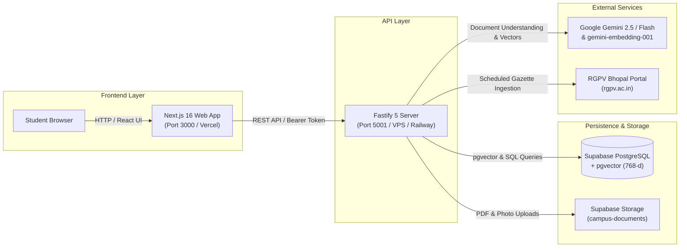

# Campus Copilot — Production Deployment Guide

This guide walks you through deploying **Campus Copilot** to production, covering the **Fastify Backend API**, **Next.js Web Frontend**, **Supabase PostgreSQL & pgvector Database**, and **Google Gemini API**.

---

## 1. Architecture Overview



---

## 2. Prerequisites

1. **Node.js**: Version `20.x` or `22.x` LTS.
2. **Supabase Project**: Free or Pro tier with PostgreSQL 15+.
3. **Google Gemini API Key**: From [Google AI Studio](https://aistudio.google.com/).
4. **Domain / Host**: VPS (Ubuntu), Railway, Render, or Vercel.

---

## 3. Step 1: Supabase Setup (Database & Storage)

### 1.1 Enable pgvector Extension & Apply Schema
1. Open your Supabase Dashboard $\rightarrow$ **SQL Editor**.
2. Run the SQL script from [`src/db/schema.sql`](file:///c:/Users/Harsh/New%20folder%20(2)/src/db/schema.sql):
   - Enables `CREATE EXTENSION IF NOT EXISTS vector;`
   - Creates `profiles`, `documents`, `notices`, `placements`, `actions`, `rgpv_notices`, `study_materials`, `pyq_questions`, and `study_plans`.
   - Builds the IVFFlat 768-d cosine index (`documents_embedding_idx`).

### 1.2 Create Storage Bucket
1. Go to **Storage** in your Supabase Dashboard.
2. Click **New Bucket**:
   - **Bucket Name:** `campus-documents`
   - **Public Bucket:** Toggle to **Enabled** (or configure authenticated signed URLs).
   - **Allowed MIME types:** `application/pdf, image/png, image/jpeg, image/webp`
   - **Max File Size:** `15MB`.

### 1.3 Obtain API Credentials
From **Project Settings** $\rightarrow$ **API**:
- **Project URL:** `https://<your-project-id>.supabase.co`
- **anon / public key:** Used for client interactions.
- **service_role key:** Used exclusively on the Fastify backend for admin queries and vector management.

---

## 4. Step 2: Environment Configuration

Create a production `.env` file on your server (or add environment variables in your deployment dashboard):

```ini
# Server Configuration
PORT=5001
HOST=0.0.0.0
NODE_ENV=production

# Supabase Credentials (from Step 1)
SUPABASE_URL=https://your-project.supabase.co
SUPABASE_SERVICE_ROLE_KEY=eyJh...your-service-role-key...
SUPABASE_ANON_KEY=eyJh...your-anon-key...
STORAGE_BUCKET=campus-documents

# Google Gemini API Key (Server-side only)
GEMINI_API_KEY=AIzaSy...your-gemini-key...

# RGPV Scraper Configuration
RGPV_BASE_URL=https://www.rgpv.ac.in
RGPV_NOTICES_URL=https://www.rgpv.ac.in/Uni/ImpNoticeArchive.aspx
RGPV_SOURCE_NAME="RGPV Bhopal"

# Frontend Configuration (for Next.js)
NEXT_PUBLIC_API_URL=https://api.yourdomain.com
```

> [!CAUTION]
> Never prefix `GEMINI_API_KEY` or `SUPABASE_SERVICE_ROLE_KEY` with `NEXT_PUBLIC_`. They must remain strictly server-side.

---

## 5. Deployment Options

### Option A: Railway / Render (Fastest PaaS Deployment)

#### Backend (Fastify):
1. Create a **New Web Service** from your GitHub repository.
2. Set **Build Command:**
   ```bash
   npm install
   ```
3. Set **Start Command:**
   ```bash
   npm run server:start
   ```
4. Add all `.env` variables from Step 2.
5. Set Healthcheck path: `/health`.

#### Frontend (Next.js on Vercel):
1. Import repository in **Vercel**.
2. Framework Preset: **Next.js**.
3. Add Environment Variable:
   - `NEXT_PUBLIC_API_URL=https://<your-railway-backend-url>.railway.app`
4. Click **Deploy**.

---

### Option B: Ubuntu / Debian VPS with PM2 & Nginx (Self-Hosted)

#### 1. Server Provisioning
```bash
# Update packages
sudo apt update && sudo apt upgrade -y

# Install Node.js 20 LTS
curl -fsSL https://deb.nodesource.com/setup_20.x | sudo -E bash -
sudo apt install -y nodejs nginx

# Install PM2 process manager
sudo npm install -g pm2
```

#### 2. Clone & Build
```bash
# Clone repository
git clone https://github.com/your-username/campus-copilot.git /var/www/campus-copilot
cd /var/www/campus-copilot

# Install dependencies & create production builds
npm install
npm run build

# Copy production .env
cp .env.example .env
nano .env  # Enter your real production keys
```

#### 3. Start with PM2
Create an `ecosystem.config.js`:
```javascript
module.exports = {
  apps: [
    {
      name: "campus-backend",
      script: "npm",
      args: "run server:start",
      env: {
        NODE_ENV: "production",
        PORT: 5001,
      },
    },
    {
      name: "campus-frontend",
      script: "npm",
      args: "run start",
      env: {
        NODE_ENV: "production",
        PORT: 3000,
      },
    },
  ],
};
```

Launch applications:
```bash
pm2 start ecosystem.config.js
pm2 save
pm2 startup
```

#### 4. Configure Nginx Reverse Proxy
Edit `/etc/nginx/sites-available/campus-copilot`:
```nginx
server {
    server_name copilot.yourdomain.com;

    # Frontend (Next.js)
    location / {
        proxy_pass http://127.0.0.1:3000;
        proxy_http_version 1.1;
        proxy_set_header Upgrade $http_upgrade;
        proxy_set_header Connection 'upgrade';
        proxy_set_header Host $host;
        proxy_cache_bypass $http_upgrade;
    }

    # Backend API (Fastify)
    location /api/ {
        proxy_pass http://127.0.0.1:5001;
        proxy_http_version 1.1;
        proxy_set_header Host $host;
        proxy_set_header X-Real-IP $remote_addr;
        proxy_set_header X-Forwarded-For $proxy_add_x_forwarded_for;
        proxy_set_header X-Forwarded-Proto $scheme;
        client_max_body_size 15M;
    }

    # Backend Healthcheck
    location /health {
        proxy_pass http://127.0.0.1:5001/health;
    }
}
```

Enable site and configure SSL:
```bash
sudo ln -s /etc/nginx/sites-available/campus-copilot /etc/nginx/sites-enabled/
sudo nginx -t
sudo systemctl restart nginx

# Install free Let's Encrypt SSL
sudo apt install -y certbot python3-certbot-nginx
sudo certbot --nginx -d copilot.yourdomain.com
```

---

## 6. Production Health & Smoke Verification

After deployment, test the live deployment endpoints:

### 1. Backend Health Check
```bash
curl https://api.yourdomain.com/health
# Expected Output:
# {"status":"ok","service":"Campus Copilot Backend Foundation","version":"0.1.0","features":{"supabase":true,"gemini":true,"pgvector":true}}
```

### 2. Live RGPV Ingestion Check
```bash
curl https://api.yourdomain.com/api/rgpv/notices
# Verifies database has synced institutional circulars
```

### 3. Copilot Grounding Check
```bash
curl -X POST https://api.yourdomain.com/api/copilot/ask \
  -H "Content-Type: application/json" \
  -H "Authorization: Bearer <VALID_JWT>" \
  -d '{"message": "What is the last date to submit the exam form?"}'
```

---

## 7. Maintenance & Monitoring

1. **Log Inspection:**
   - PM2: `pm2 logs campus-backend` / `pm2 logs campus-frontend`
   - Nginx: `sudo tail -f /var/log/nginx/error.log`
2. **Automated RGPV Sync (Cron):**
   To refresh notices every morning at 6:00 AM, add a crontab entry:
   ```bash
   0 6 * * * curl -X POST https://api.yourdomain.com/api/rgpv/sync > /dev/null 2>&1
   ```
3. **Database Backups:**
   - Enable Daily Automated Backups under Supabase Project Settings $\rightarrow$ Database $\rightarrow$ Backups.
